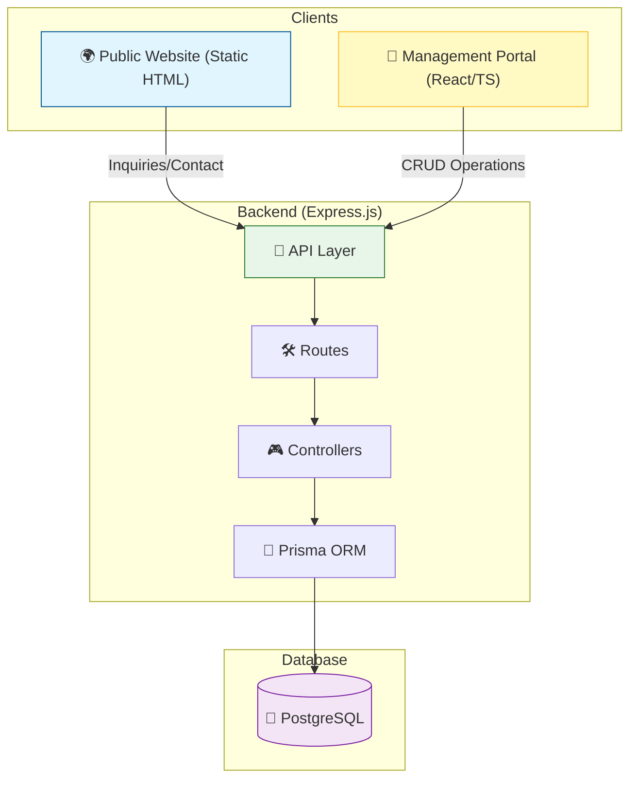

# 🏗️ Codebase Architecture Map

This document provides a high-level overview of the **School Management System (SMS)** architecture, including the service relationships, data flow, and directory structure.

## 🗺️ System Overview

The project is structured as a monorepo containing the backend server, the administrative management portal, and the public-facing website.

---

## 📁 Directory Structure

| Path | Description |
| :--- | :--- |
| `backend/` | **Node.js/Express Server**. Handles API requests, database interactions, and serves frontend static files. |
| `management-portal/` | **React/Vite Application**. The admin dashboard for staff, teachers, and administrators. |
| `school-website/` | **Static HTML Website**. The public-facing site for parents and students. |
| `demo/` | Contains demonstration or prototype versions of the application. |
| `prisma/` | Database schema and migrations managed via Prisma ORM. |

---

## ⚙️ Backend Architecture

The backend serves as the central hub for the entire system.

- **API Layer**: Provides RESTful endpoints for all modules (Students, Teachers, Attendance, Finance, etc.).
- **Static Hosting**: 
    - `/` → Serves `school-website/`
    - `/portal` → Serves `management-portal/dist/`
- **Persistence**: Uses **Prisma ORM** to interface with a **PostgreSQL** database.

### Core Modules
- **Students**: Registration, profiles, and academic tracking.
- **Academics**: Attendance, grades, homework, and exam scheduling.
- **Finance**: Fee management and salary records.
- **Communication**: Notices, calendar events, and contact messages.

---

## 💻 Frontend Applications

### 1. Management Portal (`/portal`)
- **Technology**: React, TypeScript, Vite.
- **Features**: 
    - Real-time dashboards.
    - Bulk operations (e.g., student promotion).
    - Resource management (Classrooms, Subjects, Staff).

### 2. Public Website (`/`)
- **Technology**: HTML5, CSS3, JavaScript.
- **Features**: 
    - Enrollment inquiries.
    - School gallery and events.
    - Public notices and contact forms.

---

## 🔄 Data Flow

1. **User Action**: A user interacts with the Portal or Website.
2. **Request**: The frontend makes an HTTP request to the Backend API (`/api/...`).
3. **Processing**: Express routes the request to the appropriate Controller.
4. **Data Access**: The Controller uses the Prisma Client to query or update the database.
5. **Response**: The Backend sends a JSON response back to the frontend to update the UI.

---
*Generated by Antigravity - Codebase Architecture Tool*
